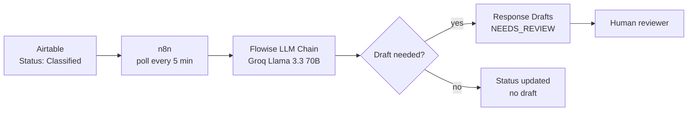

 

---

I'm a student focused on **AI integration, automation, and data** — building systems that connect LLMs and ML models to the tools teams already use. I care about prompt design, reliable pipelines, and human-in-the-loop workflows, not just demos.

Currently finishing my capstone: an [AI Email Triage & Auto-Responder](https://github.com/rimshatahir/ai-capstone-email-triage) that classifies inbox traffic and drafts replies for human review.

## Featured Project

### [Email Triage & Auto-Responder](https://github.com/rimshatahir/ai-capstone-email-triage)

An AI-powered assistant for teams drowning in email — it classifies incoming messages by category and urgency, generates draft replies, and routes everything through a review dashboard so nothing important gets lost.

| | |
|---|---|
| **Problem** | Email overload buries urgent messages and slows routine responses. |
| **My role** | **Component 2 — Auto Response Drafting:** designed the LLM prompt, built the Flowise chain (Groq Llama 3.3 70B), and wired the n8n workflow that polls Airtable, generates drafts, and writes them to a human review queue. |
| **Outcome** | 13 classified emails processed end-to-end; category-aware drafts with safety guardrails (`[insert …]` placeholders, no false promises, spam filtered via `NO_DRAFT_NEEDED`). |
| **Links** | [Capstone repo](https://github.com/rimshatahir/ai-capstone-email-triage) · [My component](https://github.com/rimshatahir/ai-capstone-email-triage/tree/main/component_2_Sabina_auto-response) · Demo video *coming soon* |

<strong>How my component fits in</strong>

 

## What I Work With

**Automation & integration** · n8n · Flowise · Airtable · Groq · Hugging Face · GitHub

**Data & code** · Python · SQL *(actively building)*

## Currently Learning

- **AI/ML & model evaluation** — understanding when to trust a model's output vs. route to human review
- **Data engineering & analysis** — stronger Python and SQL for building and testing data pipelines

## Get in Touch

Open to internships, collaborations, and conversations about AI integration and data projects.

- **LinkedIn:** [linkedin.com/in/sabina-ruzieva](https://www.linkedin.com/in/sabina-ruzieva/)
- **Email:** [sabinaruzieva04@gmail.com](mailto:sabinaruzieva04@gmail.com)
- **Portfolio:** in progress *(not deployed yet)*
